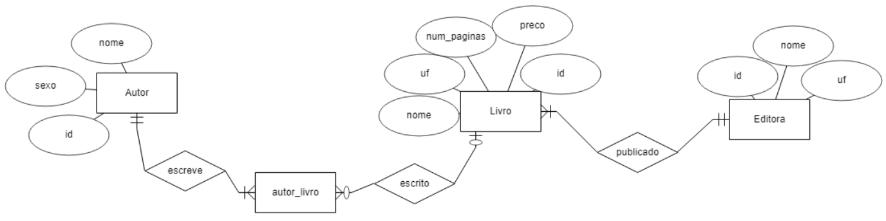
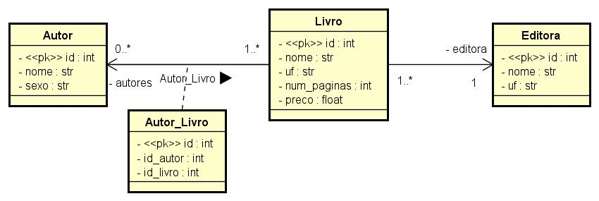

## Entidades e Atributos

1. **Livro**:
    - Descrição: É uma obra literária.
    - Atributos:
        - **id**: Identificador único do livro.
        - **nome**: Nome do livro.
        - **uf**: Unidade Federativa onde o livro foi publicado.
        - **num_paginas**: Número de páginas do livro.
        - **preco**: Preço da venda do livro.
        - **id_editora**: Identificador único da editora que publicou o livro.
        - **id_autor**: Identificador único do autor do livro.
    - Relacionamentos:
        - Um livro pode ter apenas uma editora.
        - Um livro pode ter um ou mais autores.

2. **Editora**:
    - Descrição: É uma entidade que publica livros e está localizada em uma determinada unidade federativa.
    - Atributos:
        - **id**: Identificador único da editora.
        - **nome**: Nome da editora.
        - **uf**: Unidade Federativa onde a editora está localizada.
    - Relacionamentos:
        - Uma editora pode ter um ou vários livros.

3. **Autor**:
    - descrição: É a pessoa que escreve um ou mais livros.
    - Atributos:
        - **id**: Identificador único do autor.
        - **nome**: Nome do autor.
        - **sexo**: Sexo do autor.
    - Relacionamentos:
        - Um autor pode ter um ou mais livros.

## Diagrama Entidade Relacionamento (DER)

## Dicionário de Dados

1. **Livro:**

| Atributo | Tipo de Dado | Descrição |
|----------|--------------|-----------|
| id | Inteiro | Identificador único do livro |
| nome | String | Nome do livro |
| uf | String | Unidade Federativa onde o livro foi publicado |
| num_paginas | Inteiro | Número de páginas do livro |
| preco | Decimal | Preço da venda do livro |
| id_editora | Inteiro | Identificador único da editora que publicou o livro |

2. **Editora:**

| Atributo | Tipo de Dado | Descrição |
|----------|--------------|-----------|
| id | Inteiro | Identificador único da editora |
| nome | String | Nome da editora |
| uf | String | Unidade Federativa onde a editora está localizada |

3. **Autor:**

| Atributo | Tipo de Dado | Descrição |
|----------|--------------|-----------|
| id | Inteiro | Identificador único do autor |
| nome | String | Nome do autor |
| sexo | String | Sexo do autor |

3. **autor_livro:**

| Atributo | Tipo de Dado | Descrição |
|----------|--------------|-----------|
| id | Inteiro | Identificador único da relação |
| id_autor | Inteiro | Identificador único do autor |
| id_livro | Inteiro | Identificador único do livro |

## Diagrama de Classes

;
